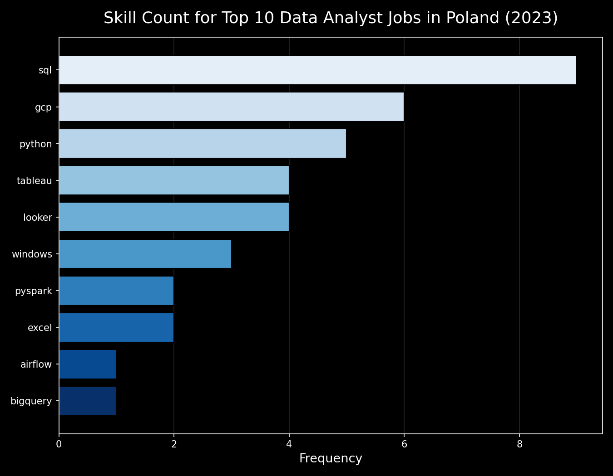

# Introduction

Dive into the Polish data job market! Focusing on data analyst roles, this project explores top-paying jobs, in-demand skills, and where high demand meets high salary in data analytics.

🔍 SQL queries? Check them out here: [project_sql folder](/project_sql/)

# Background

Driven by a quest to navigate the data analyst job market more effectively, this project was born from a desire to pinpoint top-paid and in-demand skills, streamlining others' work to find optimal jobs.

Data hails from my [SQL Course](https://lukebarousse.com/sql). It's packed with insights on job titles, salaries, locations, and essential skills.

### The questions I wanted to answer through my SQL queries were:

1. What are the top-paying data analyst jobs in Poland?
2. What skills are required for these top-paying jobs in Poland?
3. What skills are most in demand for data analysts?
4. Which skills are associated with higher salaries?
5. What are the most optimal skills to learn?

# Tools I Used

For my deep dive into the data analyst job market, I harnessed the power of several key tools:

- **SQL:** The backbone of my analysis, allowing me to query the database and unearth critical insights.
- **PostgreSQL:** The chosen database management system, ideal for handling the job posting data.
- **Visual Studio Code:** My go-to for database management and executing SQL queries.
- **Git & GitHub:** Essential for version control and sharing my SQL scripts and analysis, ensuring collaboration and project tracking.

# The Analysis

Each query for this project aimed at investigating specific aspects of the data analyst job market. Here’s how I approached each question:

### 1. Top Paying Data Analyst Jobs in Poland

To identify the highest-paying roles, I filtered data analyst positions by average yearly salary and location, focusing on jobs in Poland. This query highlights the high paying opportunities in the field.

```sql
SELECT
  job_id,
  job_title,
  job_location,
  job_schedule_type,
  salary_year_avg,
  job_posted_date,
  name AS company_name
FROM
  job_postings_fact
JOIN company_dim
ON job_postings_fact.company_id = company_dim.company_id
WHERE
  job_title_short = 'Data Analyst' AND
  job_location = 'Poland' AND
  salary_year_avg IS NOT NULL
ORDER BY salary_year_avg DESC
LIMIT 10;
```

Here's the breakdown of the top data analyst jobs in 2023:

- **Narrower Salary Range:** Top 10 paying data analyst roles span from $53,014 to $111,175, all clustering well below six-figure territory outside the top 3 listings.
- **Allegro Dominates:** 7 of the 10 listings come from Allegro alone, covering everything from junior roles to specialized positions like Pricing and CX Tech — with Capco and Westinghouse Electric Company rounding out the rest.
- **Limited Title Variety:** Titles stay close to the core role — mostly "Data Analyst" variants (Junior, Pricing, Financial Services, SAP Finance) — with no senior or director-level titles appearing in the top 10, pointing to a market concentrated at the analyst level.

| Job Title                                               | Average Salary ($) |
| ------------------------------------------------------- | -----------------: |
| Data Analyst                                            |            111,175 |
| Data Analyst (Delivery Experience Technology & Product) |            111,175 |
| Data Analyst - Financial Services                       |            111,175 |
| Data Analyst                                            |            102,500 |
| Data Analyst (CX Tech)                                  |            102,500 |
| SAP Finance Data Analyst                                |             77,018 |
| Junior Data Analyst (Campaign Team)                     |             75,068 |
| Data Analyst (Pricing)                                  |             57,500 |
| Junior Data Analyst - e-Xperience 2023                  |             53,014 |
| Junior/Mid/Senior Data Analyst (Pricing)                |             53,014 |

### 2. Skills for Top Paying Jobs in Poland

To understand what skills are required for the top-paying jobs, I joined the job postings with the skills data, providing insights into what employers value for high-compensation roles.

```sql
WITH top_paying_jobs AS (
  SELECT
  job_id,
  job_title,
  salary_year_avg,
  name AS company_name
FROM
  job_postings_fact
JOIN
  company_dim
ON job_postings_fact.company_id = company_dim.company_id
WHERE
  job_title_short = 'Data Analyst' AND
  job_location = 'Poland' AND
  salary_year_avg IS NOT NULL
ORDER BY
  salary_year_avg DESC
LIMIT 10
)

SELECT
  top_paying_jobs.*,
  skills
FROM
  top_paying_jobs
INNER JOIN skills_job_dim ON top_paying_jobs.job_id = skills_job_dim.job_id
INNER JOIN skills_dim ON skills_job_dim.skill_id = skills_dim.skill_id
ORDER BY
salary_year_avg desc;
```

Here's the breakdown of the most demanded skills for the top 10 highest paying data analyst jobs in 2023:

- **SQL** is the clear must-have: It appears in 9 of 10 listings — virtually every employer (Allegro, Capco, Westinghouse) requires it, regardless of seniority level.
- **GCP and Python** form the second tier: With 6 and 5 mentions respectively, Google Cloud and Python make up the technical core alongside SQL — mostly present in Allegro and Capco roles, less so in more "business-facing" positions like the SAP Finance Data Analyst role.
- The rest of the stack is highly specialized: **BI tools** (Tableau, Looker) show up 4 times each and are tied to specific teams, while Spark, Hadoop, SAP, and PowerPoint each appear only once — each tied to a single niche listing (e.g. SAP/PowerPoint appear exclusively in the Westinghouse finance role).


_Bar graph visualizing the count of skills for the top 10 paying jobs for data analysts; Claude generated this graph from my SQL query results_

### 3. In-Demand Skills for Data Analysts

This query helped identify the skills most frequently requested in job postings that allow work from home, directing focus to areas with high demand.

```sql
SELECT
 skills,
 COUNT(skills_job_dim.job_id) AS demand_count
FROM job_postings_fact
INNER JOIN skills_job_dim ON job_postings_fact.job_id = skills_job_dim.job_id
INNER JOIN skills_dim ON skills_job_dim.skill_id = skills_dim.skill_id
WHERE
job_title_short = 'Data Analyst'
  AND job_work_from_home = True
group BY skills
ORDER BY demand_count DESC
LIMIT 5;
```

Here's the breakdown of the most demanded skills for data analysts in 2023

- **SQL** and **Excel** remain fundamental, emphasizing the need for strong foundational skills in data processing and spreadsheet manipulation.
- **Programming** and **Visualization Tools** like **Python**, **Tableau**, and **Power BI** are essential, pointing towards the increasing importance of technical skills in data storytelling and decision support.

| Skills   | Demand Count |
| -------- | ------------ |
| SQL      | 7291         |
| Excel    | 4611         |
| Python   | 4330         |
| Tableau  | 3745         |
| Power BI | 2609         |

Table of the demand for the top 5 skills in data analyst job postings with ability to work from home.

### 4. Skills Based on Salary

Exploring the average salaries associated with different skills revealed which skills are the highest paying.

```sql
SELECT
 skills,
  ROUND(AVG(salary_year_avg), 2) AS average_salary
FROM job_postings_fact
INNER JOIN skills_job_dim ON job_postings_fact.job_id = skills_job_dim.job_id
INNER JOIN skills_dim ON skills_job_dim.skill_id = skills_dim.skill_id
WHERE
job_title_short = 'Data Analyst'
AND salary_year_avg IS NOT NULL
GROUP BY
skills
ORDER BY
average_salary DESC
LIMIT 25;
```

Here's a breakdown of the results for top paying skills for Data Analysts:

- **Niche and specialized skills command the highest premiums:** Top salaries go to analysts skilled in version control (SVN), blockchain development (Solidity), big data (Couchbase), and machine learning frameworks (DataRobot, MXNet, Keras, PyTorch, TensorFlow, Hugging Face), reflecting how employers pay a premium for rare, specialized expertise outside the standard analyst toolkit.
- **Big data & streaming infrastructure forms a closely linked second cluster:** Kafka, Cassandra, Couchbase, Scala, and Airflow reflect the value placed on distributed data processing and pipeline orchestration — the backbone technologies needed to feed and scale the systems above.
- **Cloud/DevOps infrastructure underpins both clusters:** Terraform, Ansible, Puppet, and VMware show that infrastructure-as-code and automation skills are essential to running ML and big-data systems reliably at scale, while collaboration tools like GitLab, Bitbucket, Atlassian, and Notion trail behind — useful for workflow management, but less tied to the core technical stack that drives the highest salaries.

| Skills       | Average Salary ($) |
| ------------ | -----------------: |
| svn          |            400,000 |
| solidity     |            179,000 |
| couchbase    |            160,515 |
| datarobot    |            155,486 |
| golang       |            155,000 |
| mxnet        |            149,000 |
| dplyr        |            147,633 |
| vmware       |            147,500 |
| terraform    |            146,734 |
| twilio       |            138,500 |
| gitlab       |            134,126 |
| kafka        |            129,999 |
| puppet       |            129,820 |
| keras        |            127,013 |
| pytorch      |            125,226 |
| perl         |            124,686 |
| ansible      |            124,370 |
| hugging face |            123,950 |
| tensorflow   |            120,647 |
| cassandra    |            118,407 |
| notion       |            118,092 |
| atlassian    |            117,966 |
| bitbucket    |            116,712 |
| airflow      |            116,387 |
| scala        |            115,480 |

_Table of the average salary for the top 25 paying skills for data analysts_

### 5. Most Optimal Skills to Learn

Combining insights from demand and salary data, this query aimed to pinpoint skills that are both in high demand and have high salaries, offering a strategic focus for skill development.

```sql
WITH skills_demand AS (
  SELECT
  skills_dim.skill_id,
  skills_dim.skills,
  COUNT(skills_job_dim.job_id) AS demand_count
  FROM job_postings_fact
  INNER JOIN skills_job_dim ON job_postings_fact.job_id = skills_job_dim.job_id
  INNER JOIN skills_dim ON skills_job_dim.skill_id = skills_dim.skill_id
  WHERE
  job_title_short = 'Data Analyst'
  AND salary_year_avg IS NOT NULL
  AND job_work_from_home = True
  group BY
  skills_dim.skill_id
  ), average_salary AS (
  SELECT
  skills_dim.skills,
  skills_dim.skill_id,
  ROUND(AVG(salary_year_avg), 2) AS average_salary
  FROM job_postings_fact
  INNER JOIN skills_job_dim ON job_postings_fact.job_id = skills_job_dim.job_id
  INNER JOIN skills_dim ON skills_job_dim.skill_id = skills_dim.skill_id
  WHERE
  job_title_short = 'Data Analyst'
  AND salary_year_avg IS NOT NULL
  AND job_work_from_home = True
  GROUP BY
 skills_dim.skill_id
)
SELECT
  skills_demand.skill_id,
  skills_demand.skills,
  demand_count,
  average_salary
FROM
skills_demand
INNER JOIN average_salary ON skills_demand.skill_id = average_salary.skill_id
WHERE demand_count > 10
ORDER BY
average_salary DESC,
  demand_count DESC
LIMIT 25;
```

| Skill ID | Skills     | Demand Count | Average Salary ($) |
| -------- | ---------- | -----------: | -----------------: |
| 8        | go         |           27 |            115,320 |
| 234      | confluence |           11 |            114,210 |
| 97       | hadoop     |           22 |            113,193 |
| 80       | snowflake  |           37 |            112,948 |
| 74       | azure      |           34 |            111,225 |
| 77       | bigquery   |           13 |            109,654 |
| 76       | aws        |           32 |            108,317 |
| 4        | java       |           17 |            106,906 |
| 194      | ssis       |           12 |            106,683 |
| 233      | jira       |           20 |            104,918 |
| 79       | oracle     |           37 |            104,534 |
| 185      | looker     |           49 |            103,795 |
| 2        | nosql      |           13 |            101,414 |
| 1        | python     |          236 |            101,397 |
| 5        | r          |          148 |            100,499 |
| 78       | redshift   |           16 |             99,936 |
| 187      | qlik       |           13 |             99,631 |
| 182      | tableau    |          230 |             99,288 |
| 197      | ssrs       |           14 |             99,171 |
| 92       | spark      |           13 |             99,077 |
| 13       | c++        |           11 |             98,958 |
| 186      | sas        |           63 |             98,902 |
| 7        | sas        |           63 |             98,902 |
| 61       | sql server |           35 |             97,786 |
| 9        | javascript |           20 |             97,587 |

_Table of the most optimal skills for data analyst sorted by salary_

Note: the table shows two entries for "sas" (skill_id 186 and skill_id 7) with identical demand count and salary — this isn't a data error but reflects two separate skill categories in the database: one instance is tagged under "programming languages," the other under "analyst tools," since SAS functions as both a language and a BI/analytics platform.

- **High demand doesn't guarantee the highest pay:** Python (236 postings) and Tableau (230 postings) dominate demand but sit mid-pack in salary, while lower-demand cloud/big-data skills like Go (27), Hadoop (22), and Snowflake (37) pay noticeably more. Suggesting employers pay a premium for specialized infrastructure skills that fewer analysts have, even when the volume of postings is smaller.
- **Cloud and big-data tools form the top-paying cluster:** Snowflake, Azure, BigQuery, AWS, Hadoop, and Redshift all rank near the top of the salary list, reflecting how cloud data warehousing and distributed processing skills are increasingly core to higher-paying analyst/data roles, not just engineering ones.
- **Core analyst tools remain the demand backbone but plateau in pay:** Python, R, SAS, and Tableau show by far the highest posting counts, meaning they're the baseline expected skill set for almost any data role — but their salaries cluster closer to the middle of the range, indicating that fluency in them is necessary but no longer a strong salary differentiator on its own.

# What I Learned

Over the course of this project, I significantly expanded my SQL skill set in the following areas:

- **Advanced Query Construction:** Developed proficiency in complex SQL techniques, including joining multiple tables and using WITH clauses (CTEs) to structure temporary result sets effectively.

- **Data Aggregation:** Gained a solid working knowledge of GROUP BY statements and aggregate functions such as COUNT() and AVG() to summarize and analyze data efficiently.

- **Analytical Problem-Solving:** Strengthened my ability to translate real-world business questions into structured, actionable SQL queries that deliver meaningful insights.

# Conclusions

### Insights

Based on the analysis, the following general insights emerged:

- **Top-Paying Data Analyst Jobs**: The highest-paying data analyst positions in Poland span a relatively narrow/consistent range topping out at $111,175.

- **Skills for Top-Paying Jobs:** High-paying data analyst roles consistently require advanced proficiency in SQL, indicating that it is a critical skill for achieving top-tier compensation.

- **Most In-Demand Skills:** SQL is also the most frequently requested skill across data analyst job postings, making it essential for job seekers to master.

- **Skills Associated with Higher Salaries:** Specialized skills such as SVN and Solidity correspond to the highest average salaries, reflecting a premium placed on niche technical expertise.

- **Optimal Skills for Market Value:** While SQL doesn't appear in the top 25 optimal-skills table by salary, its overwhelming presence across nearly every other query (demand, top-paying jobs, in-demand skills) confirms it as the foundational skill on which all other specializations are built — making it the essential starting point before layering on higher-paying niche skills like cloud platforms or ML frameworks.

### Closing Thoughts

This project strengthened my SQL skills while offering meaningful insight into the data analyst job market. The findings serve as a practical guide for prioritizing skill development and shaping job search strategy. By focusing on skills that combine high demand with strong salary potential, aspiring data analysts can position themselves more competitively in the market. Overall, this exploration underscores the importance of continuous learning and staying adaptable to emerging trends within the field of data analytics.
